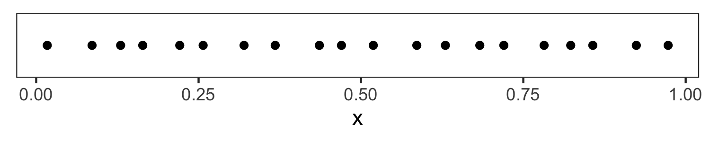
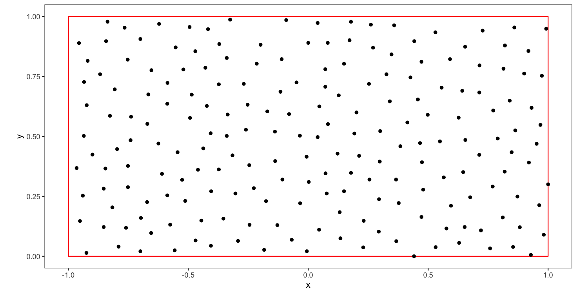
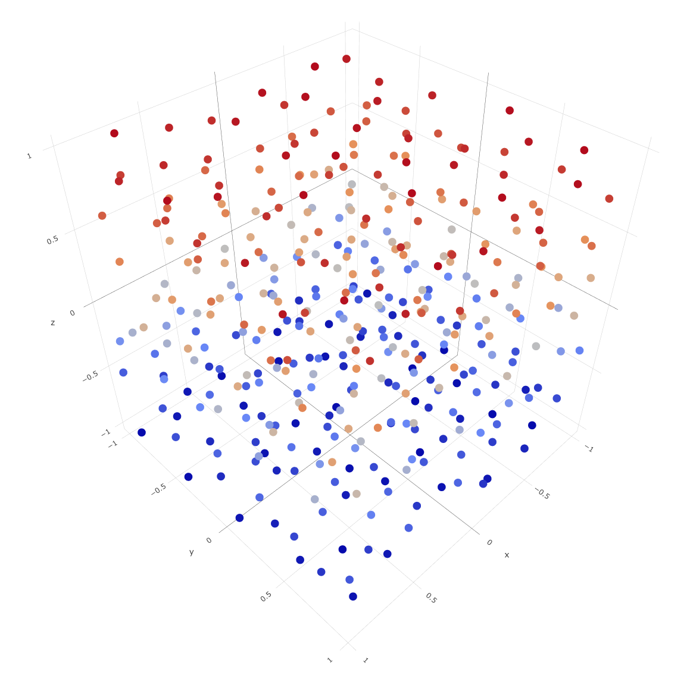

# poissimple

poissimple is a JavaScript package that implements simple/naive [Poisson disk sampling (PDS)](https://www.jasondavies.com/poisson-disc/).
It allows for the generation of a given number of points in any number of dimensions, with tileability as an option.

If you require speed and efficiency, or features like varying sample density, it is recommended to use an alternative like [poisson-disk-sampling](https://github.com/kchapelier/poisson-disk-sampling) (which is a great package, and the main inspiration for the API of poissimple).

## Installation
The module is available on npm:

```
npm install poissimple
```

## Description
While seemingly every other implementation of PDS requires the user to specify the minimum distance between samples, poissimple lets the user generate a given number of points.
The minimum distance is computed using a heuristic that works reasonably well in 1, 2 and 3 dimensions.
There are no guarantees for 4 dimensions and above.

poissimple uses a brute-force approach, which requires computing the pairwise distances between every new candidate and the previously accepted points.
This leads to a time complexity of O(n²), where n is the number of points to be generated.
While slower than the O(n) [Bridson algorithm](https://www.cs.ubc.ca/~rbridson/docs/bridson-siggraph07-poissondisk.pdf), poissimple is useful in cases where a small, specified number of points is needed.

To give an idea of the performance, the table below shows the average time needed to generate a certain number of points in dimensions 1 through 4
(measured in milliseconds on a 2020 M1 MBP):

<center>

| n /  Dimensions  | 1 | 2 | 3 | 4 |
| ------------- | ------------- | ------------- | ------------- | ------------- |
| 10 | 0.6 | 0.5 | 0.4 | 0.6 |
| 20 | 1.1 | 0.8 | 1 | 1.1 |
| 50 | 3.2 | 2.9 | 2.5 | 1.6 |
| 100 | 11.5 | 9.6 | 10.6 | 9.3 |
| 200 | 37.4 | 38.8 | 41.2 | 31.9 |
| 500 | 234 | 255 | 300 | 240 |
| 1000 | 924 | 980 | 1209 | 1064 |
| 2000 | 3658 | 4030 | 5001 | 4562 |
| 4000 | 14522 | 16888 | 21677 | 19472 |

</center>

For n <= 200, poissimple is fast enough for many uses.

## Examples of use

### **One-dimensional points:**
Maybe not the most useful feature, but nonetheless possible.
The code below generates 20 points on the interval [0, 1]:

``` js
const ps = new Poissimple({
    n: 20,
    dimensions: 1,
    extent: [0, 1]
});
console.log(ps.fill()); // Outputs array of values: [x1, x2, x3, ...]
```

<p align="center">
    </img>
</p>

### **Two-dimensional points:**
Next, we generate 200 two-dimensional points in the rectangle [-1, 1] × [0, 1], with `periodic` set to `true`.
The distance between points are then computed as if the opposite horizontal and vertical boundaries are "connected/glued together", which ensures that the points are tileable.

``` js
const ps = new Poissimple({
    n: 200,
    dimensions: 2,
    extent: [[-1, 1], [0, 1]],
    periodic: true
});
console.log(ps.fill()); // Outputs array of arrays: [[x1, y1], [x2, y2], ...]
```
<p align="center">
    </img>
</p>

### **Three-dimensional points:**
If `extent` is not specified, the coordinate bounds will be [-1, 1] along each dimension.
In the 3D case, the default extent is the cube [-1, 1] × [-1, 1] × [-1, 1].
Below we sample 400 points in this cube and plot them, letting the color vary with the z-coordinate.


``` js
const ps = new Poissimple({
    n: 400,
    dimensions: 3,
});
console.log(ps.fill()); // Outputs array of arrays: [[x1, y1, z1], [x2, y2, z2], ...]
```

<p align="center">
    </img>
</p>

## API

### Constructor

**new Poissimple(options[, rng])**

- *options :*
  - *n :* The number of points to generate, required
  - *dimensions :* The dimensionality of the points, defaults to 2
  - *extent :* The extent of the space to sample points from. For one-dimensional sampling, specify an array containing a lower and upper value (e.g. [-1, 1]). Otherwise, specify an array containing one array per dimension (e.g. [[-1, 1], [0, 1]] for the rectangle [-1, 1] × [0, 1]). Defaults to an extent with lower bound -1 and upper bound 1 along each dimension
  - *periodic :* Specifies whether the distance between two points should be measured as if opposite boundaries are "glued together"/periodic. For example: If the extent is [0, 1] (1D), the distance between 0.1 and 0.9 is 0.8 when `periodic = false`, but 0.2 when `periodic = true`. Leads to tileable points. Either a boolean or an array with one boolean per dimension, defaults to false
  - *tries :* The number of points generated before the algorithm gives up and uses the best candidate, defaults to 30
- *rng :* The random number generator function used when generating points, defaults to Math.random

``` js
// Samples 50 1D values
const ps = new Poissimple({
    n: 50,
    dimensions: 1,
    extent: [[-1, 1], [0, 1]],
    periodic: false,
    tries: 15
});
```

``` js
// Samples 100 2D points that are tileable along x-axis using custom RNG
const customRng = createRng(seed);
const ps = new Poissimple({
    n: 100,
    dimensions: 2,
    extent: [[-1, 1], [0, 1]],
    periodic: [true, false],
    tries: 15
}, customRng);
```

### Method

**ps.addPoint(point)**

Manually adds a point to the object.
Ensures that the value of `point` has the correct dimensions, but does not check distance to existing points.

``` js
ps.addPoint([0.2, 0.4]);
```

**ps.next()**

Generates and returns the next point.
If `n` points have already been generated, the returned value is `null`.
``` js
const point = ps.next();
console.log(point);
```

**ps.fill()**

Generates and fills the object with `n` points, which are returned as an array.

``` js
const points = ps.fill();
```

**ps.getPoints()**

Returns an array containing the generated points.

``` js
const points = ps.getPoints();
```